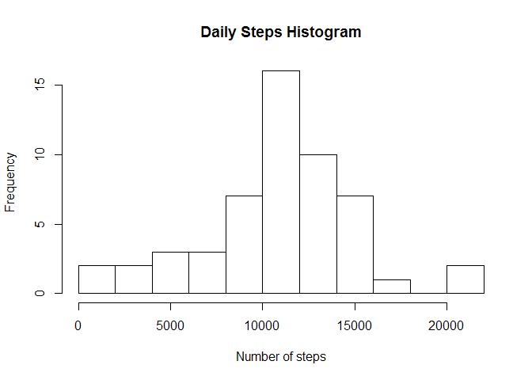
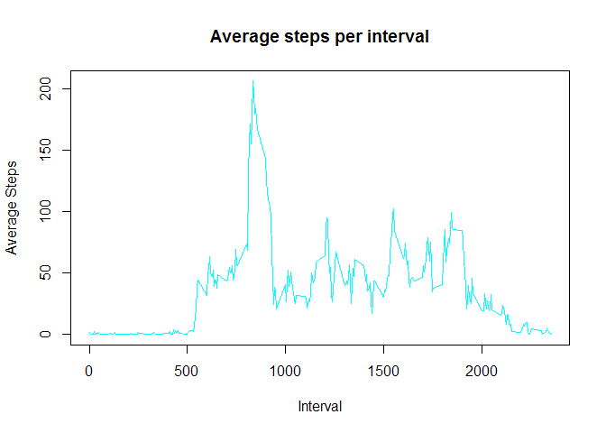
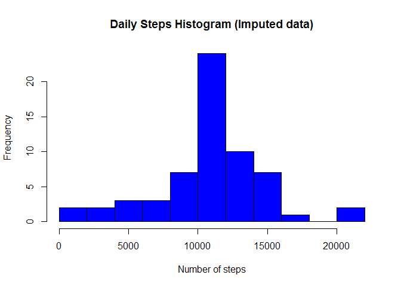
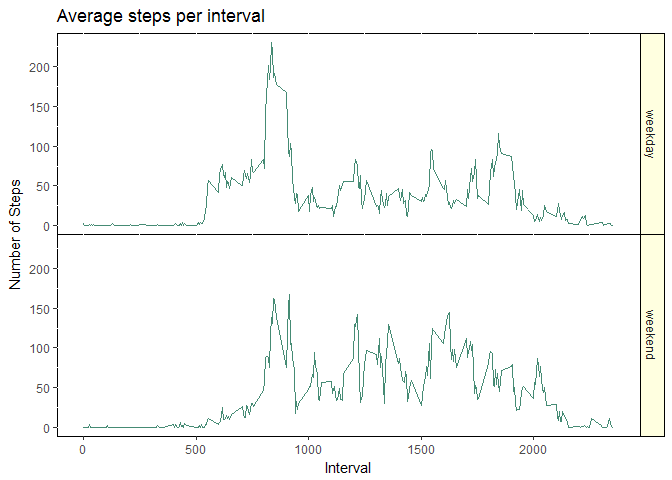

# Reproducible Research: Peer Assessment 1


```r
library(Hmisc)
```

```
## Loading required package: lattice
```

```
## Loading required package: survival
```

```
## Loading required package: Formula
```

```
## Loading required package: ggplot2
```

```
## 
## Attaching package: 'Hmisc'
```

```
## The following objects are masked from 'package:base':
## 
##     format.pval, round.POSIXt, trunc.POSIXt, units
```

## Loading and preprocessing the data

```r
# assuming that the datafile is located in the subdirectory named activity
rawdata <- read.csv("activity/activity.csv")
```


## What is mean total number of steps taken per day?

```r
dailysteps <- aggregate(steps ~ date, rawdata, sum)
hist(dailysteps$steps, breaks = 10, main="Daily Steps Histogram", xlab="Number of steps")
```

<!-- -->

```r
dailystepsmean <- mean(dailysteps$steps)
dailystepsmedian <- median(dailysteps$steps)
```

Mean of total daily steps is 10766.19 and the median of total daily steps is 10765.

## What is the average daily activity pattern?

```r
dailyintervalsteps <- aggregate(steps ~ interval, rawdata, mean)
plot(dailyintervalsteps$interval, dailyintervalsteps$steps, type="n", main="Average steps per interval", xlab="Interval", ylab="Average Steps")
lines(dailyintervalsteps$interval, dailyintervalsteps$steps, type="l", col="cyan")
```

<!-- -->

```r
maxintervalsteps = max(dailyintervalsteps$steps)
maxstepsinterval = subset(dailyintervalsteps, steps == maxintervalsteps)
```

Maximum average steps in an interval were 206.1698113 during the interval 835.


## Imputing missing values

```r
naRows <- which(is.na(rawdata))

totalNAs <- length(naRows)
```

We have 2304 rows with NA values. We have observed that NA values generally cover the entire day.
We will replace these NA values with the mean value for the same interval.


```r
for (i in 1:totalNAs)
{
    rawdata$steps[naRows[i]] <- subset(dailyintervalsteps, interval == rawdata$interval[naRows[i]])$steps
}
```

### Calculate the Mean total number of steps taken per day with Imputed data

```r
i.dailysteps <- aggregate(steps ~ date, rawdata, sum)
hist(i.dailysteps$steps, breaks = 10, main="Daily Steps Histogram (Imputed data)", xlab="Number of steps", col="blue")
```

<!-- -->

```r
i.dailystepsmean <- mean(i.dailysteps$steps)
i.dailystepsmedian <- median(i.dailysteps$steps)
```

Mean of total daily steps for imputed data is 10766.19 and the median of total daily steps is 10766.19.

Mean of total daily steps is 10766.19 and the median of total daily steps is 10765.


## Are there differences in activity patterns between weekdays and weekends?

```r
# Add a new column in rawdata, assign the vaue and convert to factor
rawdata$dayofweek <- ifelse(substr(weekdays(as.Date(rawdata$date)),1,1) =="S", "weekend", "weekday")
rawdata$dayofweek <- as.factor(rawdata$dayofweek)


dailyintwksteps <- aggregate(steps ~ interval + dayofweek, rawdata, mean)
#par(mfraw= c(2,1), mar = c(5,4,1,1))

g <- ggplot(dailyintwksteps, aes(interval, steps))
g1 <- g + geom_line(color="aquamarine4") + facet_grid(dayofweek~.) + labs(x="Interval", y="Number of Steps", title="Average steps per interval") + theme(panel.background = NULL, panel.grid = NULL, panel.spacing.y = unit(0, units="points"), strip.background = element_rect(fill = "lightyellow", color = "black"))
print(g1)
```

<!-- -->

